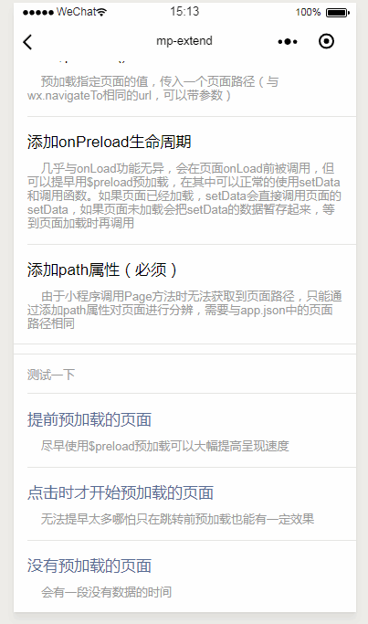

## 通过页面预加载（preload）提升小程序的响应速度 ##

### 主要目标 ###

如果小程序在打开新页面时需要通过网络请求从接口中获取所用的数据，在请求完成之前页面都会因为没有数据而呈现一片空白，解决这个问题常见的解决方案有：

1. 先使用从缓存中取出上一次的数据，等到请求结束后再使用请求得到的数据（这个对于变动不大的数据是完全可行的，但是对于变动大或者以内容为主的功能并不合适）

2. 在加载时显示[骨架屏](https://segmentfault.com/a/1190000016689372)（知乎和饿了么的移动端有的地方是这么做的）

3. 前一个页面预加载下一个页面的数据，达到秒开的效果

很明显，缓存并不广泛适用，骨架屏只是一个比loading图标好看的占位符，而预加载能够完全符合要求。

但是在小程序中如果要实现预加载的功能便需要在页面中操作其他页面（包括还没有创建实例的页面），会使代码严重耦合，不利于维护，需要一个更清晰的结构来实现预加载功能。

### 设计思路 ###

1. 小程序中实现预加载能力的关键便是能够调用其他页面的函数，需要获取其他页面对象。但是部分页面还没有加载出来，getCurrentPages方法获取不到，因此需要把被预加载的页面的PageOption（就是在创建页面时传入Page函数的对象）给保存起来

2. 那些没有被创建的页面并没有setData方法，需要模拟一个setData方法，把获取到的数据暂存起来，在onLoad阶段再调用 setData呈现到视图上

3. 页面应当可以主动被预加载，但是在没有被预加载的时候也应该能够正常打开

### 源码实现 ###

1. 重写Page函数，保存需要预加载页面的PageOption

2. 扩展小程序页面的生命周期 onPreload，与onLoad功能功能基本相同，能够接收来自url的参数，在主动预加载时被调用

3. 提供 this.$reload(url) 方法，用于主动预加载某个页面，如果页面实例未创建就把预加载的数据保存起来，等到页面onLoad时再调用setData呈现到视图上

### 最终效果 ###

### 参考资料
> [wxpage](https://github.com/tvfe/wxpage)
> [微信小程序之提高应用速度小技巧](https://wetest.qq.com/lab/view/294.html)